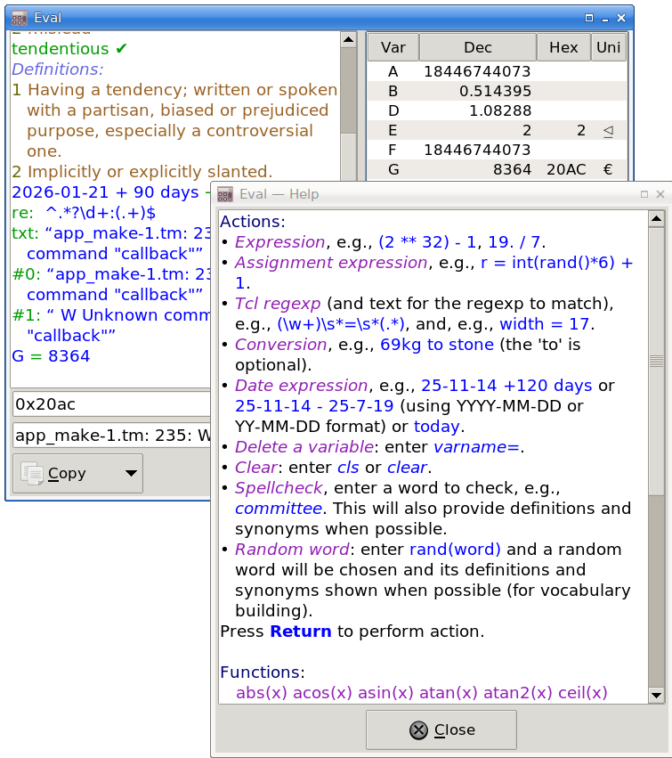

# Eval

`eval.tk` is a GUI “calculator-evaluator” which can compute expressions, Tcl
regexps, simple conversions, and simple date expressions.

Note: I use [Store](https://github.com/mark-summerfield/store) for version
control so github is only used to make the code public.

## Dependencies

Tcl/Tk >= 9.0.2; Tcllib >= 2.0; Tklib >= 0.9.

## License

GPL-3

---
